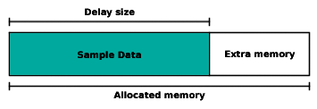
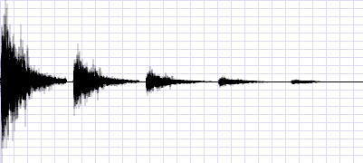
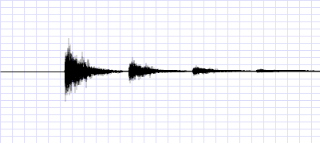

# Using Reverb

Maxmod can take advantage of the special sound capturing hardware to produce
simple reverb. The reverb is done *completely* by the sound hardware and
requires no additional work by the CPU.

## Configuring the Reverb Unit

The reverb unit is controlled through the **mmReverbConfigure()** function. It
takes somewhat flexible input data and sends a variable amount of data to the
ARM7 to process.

Before configuring the reverb unit, you must call **mmReverbEnable()** to
initialize the system.

The reverb unit consists of 2 channels (left speaker/right speaker) which each
have 7 registers that control their operation. The configuration function can
set one or more of the registers to a certain value. Here's an example to change
the *feedback* level of the left output to 80%.

```c
mm_reverb_cfg config;
config.flags = MMRF_FEEDBACK | MMRF_LEFT;
config.feedback = 80 * 2047 / 100;
mmReverbConfigure(&config);
```

The *flags* member of the configuration struct selects which data in the
structure is valid and should be sent to the reverb unit. In this case, we want
to change only the *feedback* register.

By selecting MMRF\_LEFT in the flags, this operation will affect the left reverb
output. We can also select MMRF\_RIGHT to affect the right output, or even
MMRF\_BOTH (which is equivalent to MMRF\_LEFT|MMRF\_RIGHT) to apply the settings
to both outputs.

The feedback register ranges from 0->2047, so this is 80%.

This article will describe each register in full detail.

## Delay

The delay register is used to set the amount of delay there will be between the
dry sound and reverbed (wet) sound. The delay value is actually a measurment of
memory. It measures the size of the memory required for the delay buffer.



The above diagram displays a block of memory (see Memory register), with a
region of it used for sampled data. While reverb is active, the existing sampled
data in the delay buffer is output to the speakers, and new data is sampled into
it.


In Figure 1.2 we see an example of the delay ring buffer, looking at the area
that is being written to (and read). As the playback position moves through the
buffer, newly sampled data is written just behind the played sample. Then the
playback position has to loop through the whole delay buffer before it reaches
the sampled data it wrote earlier, this gives the delay effect.

Note that when you first start the reverb, unknown data will be played during
the first loop through the ring buffer, you should clear the delay buffer to
zero before starting the reverb to avoid playing temporary invalid data.

### Setting the delay

Before you set the delay, make sure that your allocated memory region is large
enough to hold the sampled data required. The easy way to guess this is
allocating memory with size equal to the amount you write to the delay register
(measured in *words*).

The size of the delay buffer depends on three things. The delay amount, the
sampling rate, and the sampling format. The formula to calculate the amount of
bytes required is: *(delay \* format \* rate) / 1000*. In the formula, delay is
measured in milliseconds, format may be 8 or 16 meaning 8-bit or 16-bit, and
rate is the sampling rate measured in Hertz. There is a function to calculate
this amount (and return number of words). See **mmReverbBufferSize()**.

To set the delay, add MMRF\_DELAY to the flags and store the new *delay* setting
in the delay member. Again, the value to be written to it is the size of the
delay buffer measured in words.

## Feedback

The feedback register is used to control the volume of the sampled data that is
feed back into the hardware mixer. This can be thought of as the *volume* of the
reverb.


Above we see a computer generated image displaying a dry sample. This is the
output you will get with 0% feedback.


Now we see the same sample with reverb/echo applied to it. You can see the
sample pattern repeating at decreasing levels of volume. The space between
repeating patterns is controlled by the *delay* setting.


And now, we see output that is corrupted from too much feedback! You must take
care not to specify a feedback level that is too high, or else the feedback may
grow too large and cover the output.

### Setting the feedback

To set the feedback, add MMRF\_FEEDBACK to the flags and store the new setting
in the *feedback* member. The feedback value ranges from 0 to 2047 which
represents 0% to 100%.

## Panning

Next, we have the *panning* register. This register controls which speakers will
output the reverbed sound.

After the sound data is captured from the left or right mixers with previous
reverb feedback applied, the sound may be panned to another position. For
example, the left reverb channel captures the output from the left speaker. The
left reverb channel can then output the affected sound through the right speaker
with a certain panning setting.

To change the panning value, add MMRF\_PANNING to the flags and store the new
value in the *panning* member. The panning value ranges from 0 to 127.
Specifying 0 will make the sound output to the left 100%. 127 will output the
sound to the right 100%. Values between 0->127 will output a certain fraction of
the sound to both speakers. 64 will output an equal amount to both speakers.

There's also a special flag, MMRF\_INVERSEPAN, that you can use when applying
panning to both channels. If MMRF\_BOTH and MMRF\_INVERSEPAN are used together,
then the panning of the left channel will be set to the normal specified value,
and the panning of the right channel will be set to an inversed value
(128-value).

## Memory

The memory register holds the memory address of your reverb buffer. You *must*
specify the memory address in this register before starting reverb output. The
size of memory required depends on three things (I'll repeat them): the delay,
the sampling rate, and the output format. You can calculate the amount memory
required with the **mmReverbBufferSize()** function. The reverb channels can not
share the same memory region, one region must be allocated for each channel.

To assign a memory region to a reverb channel, add MMRF\_MEMORY to the flags, and
store the memory address in the *memory* entry.

If MMRF\_BOTH and MMRF\_MEMORY are used together, the delay setting (even if not
selected) will be added to the memory address for the right channel.

## Dry Output

This is a simple setting that controls wether the dry output from the hardware
mixer is to be heard with the reverb.



Above we see the output when the dry output is enabled. This is usually the
desired output.



Now we see the same output, except without the dry source at the beginning. This
feature might be useful under certain conditions.

To switch the dry output on or off add MMRF\_DRYLEFT, MMRF\_NODRYLEFT,
MMRF\_DRYRIGHT, and/or MMRF\_NODRYRIGHT to the flags to issue the command.

## Rate

This setting controls the sampling rate for a reverb channel. Higher sampling
rates offer better quality at the cost of a higher memory requirement. The value
of this register is a frequency divider. The value for this register can be
calculated with the formula *2^24 / Hertz*.

Note that changing this value affects the scale of the delay register. If you
want to keep the same delay, you must recalculate the delay value after
modifying this register.

Also note that if you change the sampling rate while the reverb is active, there
will be a pitch shift in the reverb output from playing previously sampled data
(which was sampled at a different rate). The pitch shift will be present until
one cycle of the reverb buffer passes.

To set the sampling rate, add MMRF\_RATE to the configuration flags with the new
rate stored in the rate entry. The sampling rate shouldn't exceed 32768 Hz and
cannot drop below 256 Hz.

## Format

By default, the reverb is set to capture 16-bit data from the mixer. 16-bit data
provides much higher quality, but 8-bit data provides half of the memory load.

To switch the channels into a different format, add
MMRF\_8BITLEFT/MMRF\_8BITRIGHT/MMRF\_16BITLEFT/MMRF\_16BITRIGHT to the flags to
activate the format change command.

This setting cannot be changed while the reverb is active. If the reverb is
active when this setting is affected, the reverb output will be switched off.

## Starting/Stopping

Finally, to start the reverb, use **mmReverbStart()**. The function takes one
parameter which selects which reverb channels to start. Pass MMRC\_LEFT,
MMRC\_RIGHT, or MMRC\_BOTH.

To stop the reverb, use **mmReverbStop()**. The function takes a parameter just
like the starting function.

Before starting the reverb, you must configure the other reverb registers first.

## Example Configuration

Here is an example that configures the reverb unit.

```c
enum {
    rv_delay_left = 280,  // Milliseconds
    rv_delay_right = 288,
    rv_rate = 32768,      // Hertz
    rv_format = 16        // 16-bit
};

void setupReverb(void)
{
    // Enable reverb system
    mmReverbEnable();

    void* rv_buffer_left;
    void* rv_buffer_right;

    int rv_size_left;
    int rv_size_right;
    rv_size_left = mmReverbBufferSize(rv_format, rv_rate, rv_delay_left);
    rv_size_right = mmReverbBufferSize(rv_format, rv_rate, rv_delay_right);

    // allocate memory for both reverb channels
    rv_buffer_left  = malloc(rv_size_left * 4);
    rv_buffer_right = malloc(rv_size_right * 4);

    mm_reverb_cfg config;

    // setup reverb channels...
    config.flags = MMRF_MEMORY | MMRF_DELAY | MMRF_FEEDBACK |
                   MMRF_PANNING | MMRF_DRYLEFT | MMRF_DRYRIGHT |
                   MMRF_RATE | MMRF_16BITLEFT | MMRF_16BITRIGHT |
                   MMRF_INVERSEPAN | MMRF_BOTH;

    // Set memory target (for left)
    config.memory = rv_buffer_left;

    // Set delay (for left)
    config.delay = rv_size_left;

    // Set feedback to 50% (for both)
    config.feedback = 1300;

    // Set panning to ~25% (and inversed (75%) for right channel)
    config.panning = 32;

    // Set sampling rate for both channels
    config.rate = 16777216 / rv_rate;

    // Do configuration...
    mmReverbConfigure(&config);

    // Give the right channel slightly more delay and set the memory buffer
    config.flags = MMRF_MEMORY | MMRF_DELAY | MMRF_RIGHT;

    config.delay = rv_size_right;
    config.memory = rv_buffer_right;

    mmReverbConfigure(&config);

    mmReverbStart(MMRC_BOTH);
}
```

## Closing

For a better understanding, please have a look at the reverb example source
code.
