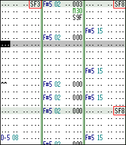

# Using Song Events

This article will explain a bit on how to create and receive song events.

Song events are triggered by the unused effect SFx with S3M and IT modules, or
EFx with MOD and XM modules.



Above is a piece from the final boss music of *Super Wings*. The SF3 effect is a
signal for the boss to dissapear from the screen. The SF8 effects are cues for a
fresh batch of *laser shurikens* to appear :). In the previous pattern, there is
an SF2 effect to tell the boss to move to the center of the screen (before
dissapearing).

If you are confused, you should go play
[Super Wings](http://www.pdroms.de/files/1597/) right now!

## Handling Song Events

To receive song events, you must first setup a special callback function. After
that you can use the **mmSetEventHandler()** function.

```c
mm_word myEventHandler( mm_word msg, mm_word param )
{
    switch( msg )
    {
    case MMCB_SONGMESSAGE:
        // Process song message
        break;
    case MMCB_SONGFINISHED:
        // A song has finished playing
    }
}
```

There are two types of events received through this function.

### MMCB\_SONGMESSAGE

This is the event that was explained above. **param** will contain the number
specified in the pattern effect (ie. param will be 1 for SF1/EF1).

### MMCB\_SONGFINISHED

This is another special event that occurs when the song reaches the **END**
marker. It only happens if you passed **MM_PLAY_ONCE** to **mmStart()**.
**param** will contain either 0 or 1. If the *main* module has ended, it will
contain 0. If the *sub* module (jingle) has ended, it will contain 1.

Use the **mmSetEventHandler()** function to install your handler. Call this
after you have initialized Maxmod.

```c
mmSetEventHandler( myEventHandler );
```
